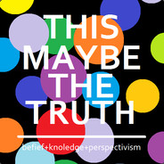

# This ~~is~~ _Maybe_ the Truth

## Introduction

 Perspectivism is a philosophical framework for evealuating beliefs when no absolute truth can be known.

 This Maybe the Truth is a collection of chapters ( or book ) explaining the core assumption of Perspectivism, why you should adopt it and how to handle the implications and complications it presents.

## Chapters

* [Chapter 0: Identity](book/Chapter_0.md)
* Why delve into Philosophy
* What is Truth
* What is Knowledge
* Why you can't trust your senses
* On Dogmatism
* Perspectivism Statement:
  * "One can never know the absolute truth. Even if one does, they can never prove it."
  * The self-contradiction
  * Idea of the statement being a belief
* Free Speech
* I think therefore I am
* Logic and Reason
* The Scientific Method
* Utilitarian View on Beliefs
* How Perspectivism can benefit you

## Brain Food

 More ideas by the Author, [da_Revo](https://medium.com/@da_revo) :

 [https://medium.com/screaming-into-the-void](https://medium.com/screaming-into-the-void)
